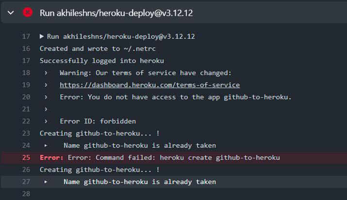
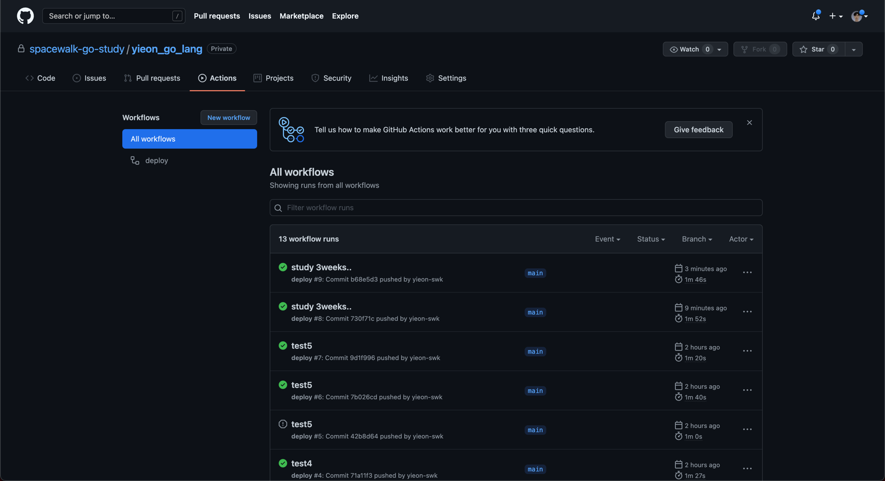
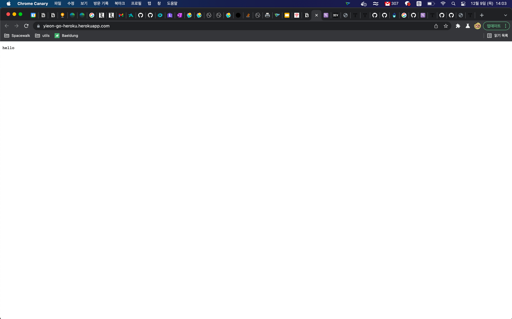

# yieon의 Golang Study

###[Heroku](https://devcenter.heroku.com/articles/getting-started-with-go#set-up)

###[go framework stars](https://github.com/mingrammer/go-web-framework-stars)

###[gin-gonic](https://github.com/gin-gonic/gin)

##[1주차 스터디 - 가볍게 Go 입문하기]

##[2주차 스터디 - Github Action을 통한 Go-Heroku 배포 따라하기]

1. Heroku 회원가입
2. Github 회원가입
3. Git Organization 등록하기
4. Go Project 만들기
5. Github에 Project 올리기
6. Github Action 설정하기
    1. Github Secrets `HEROKU_API_KEY` 추가하기
7. 오류 발생
    
8. 오류 해결하기
    1. .github/workflows/myAction.yml파일에서 다음과 같이 수정합니다.

        ```yaml
        name: myAction
        
        on:
          push:
            branches: [main]
          pull_request:
            branches: [main]
        
        jobs:
          build:
            runs-on: ubuntu-latest
            steps:
              - uses: actions/checkout@v2
        
              - name: Set up Go
                uses: actions/setup-go@v2
                with:
                  go-version: 1.16
        
              - name: Build
                run: go build -v -o ./bin/[Heroku에등록할이름(중복불가)]
        
              - uses: akhileshns/heroku-deploy@v3.12.12 # This is the action
                with:
                  heroku_api_key: ${{secrets.HEROKU_API_KEY}}
                  heroku_app_name: [Heroku에등록할이름(중복불가)] #Must be unique in Heroku
                  heroku_email: [Heroku계정]
        ```

       다음 예시와 같이 수정하시면 됩니다.

        ```yaml
        - name: Build
          run: go build -v -o ./bin/yieon-go-heroku
        
        - uses: akhileshns/heroku-deploy@v3.12.12 # This is the action
                with:
                  heroku_api_key: ${{secrets.HEROKU_API_KEY}}
                  heroku_app_name: "yieon-go-heroku" #Must be unique in Heroku
                  heroku_email: "parrotbill@naver.com"
        ```

9. Action 상태 확인하기

10. 배포 확인하기
    
    1. [https://yieon-go-heroku.herokuapp.com/](https://yieon-go-heroku.herokuapp.com/)
    


##[3주차 스터디 - Templates 동작]

# 학습하기

## Heroku

1. Heroku 설치하기

   [Getting Started on Heroku with Go](https://devcenter.heroku.com/articles/getting-started-with-go#set-up)

2. 터미널에서 Heroku 로그인하기
    - `heroku login`
3. Heroku로 실행중인 App 확인하기
    - `heroku apps`
4. Heroku로 실행중인 App Log 확인하기
    - `heroku logs -a "myApp" -t`

## gin-gonic

[https://github.com/gin-gonic/gin](https://github.com/gin-gonic/gin)

- `go get -u github.com/gin-gonic/gin`
- why gin?

  [https://github.com/mingrammer/go-web-framework-stars](https://github.com/mingrammer/go-web-framework-stars)


## Generate Templates

[4-5주차]

# 학습하기

### 반복

[반복](https://miryang.gitbook.io/learn-go-with-tests/go/iteration)

### 배열과 슬라이스

[배열과 슬라이스](https://miryang.gitbook.io/learn-go-with-tests/go/arrays-and-slices)

### 테스트

- 테스트 구조 만들기
    1. 프로젝트 메인 위치에 test 폴더를 생성합니다.
    2. test 폴더안에 이번 학습 주제인 반복을 위한 iteration 폴더를 생성합니다.
        - **주의:** Go의 소스 파일은 각 폴더에 하나의 `package`만 가질 수 있다. 파일이 별도로 구성되어 있는지 확인해야 한다. [여기에 좋은 예시가 있다.](https://dave.cheney.net/2014/12/01/five-suggestions-for-setting-up-a-go-project)
        - 테스트 파일은 **반드시** _test가 명시되어야 합니다.

    3. 테스트 파일 내용을 작성합니다.
        - /test/iteration/repeat_test.go

            ```go
            package iteration
            
            import "testing"
            
            func TestRepeat(t *testing.T) {
            	repeated := Repeat("a")
            	expected := "aaaaa"
            
            	if repeated != expected {
            		t.Errorf("expected %q but got %q", expected, repeated)
            	}
            }
            
            func Repeat(character string) string {
            	var repeated string
            	for i := 0; i < 5; i++ {
            		repeated = repeated + character
            	}
            	return repeated
            }
            ```

    4. 작성한 테스트를 실행합니다.
        - 실행 방법
            1. 프로젝트 Root에서 터미널 창을 엽니다.
            2. test 폴더 아래 iteration 폴더 위치까지 이동합니다 `cd test/iteration`
            3. 테스트 명령어를 입력합니다 `go test`

            ```bash
            cd test/iteration
            go test
            ```

            1. 결과 확인하기


- 더 나아가기 (테스트 로그 활용)
    - 테스트를 하면서 변수의 값은 확인할 수 없습니다. 테스트 코드의 Log를 활용하여 이를 확인할 수 있습니다.
        - repeat_test.go 파일에 t.Logf 추가하기

            ```go
            package iteration
            
            import "testing"
            
            func TestRepeat(t *testing.T) {
            	repeated := Repeat("a")
            	expected := "aaaaa"
            
            	if repeated != expected {
            		t.Errorf("expected %q but got %q", expected, repeated)
            	}
            
            	t.Logf("expected: %q", expected)
            	t.Logf("repeated: %q", repeated)
            }
            
            func Repeat(character string) string {
            	var repeated string
            	for i := 0; i < 5; i++ {
            		repeated = repeated + character
            	}
            	return repeated
            }
            ```

        - `go test -v` 명령어로 테스트 실행하기
        - 결과 확인하기


- 배열과 슬라이스 테스트 코드 작성하기
    - 예제 1번)
        - test 폴더 아래 arrays 폴더를 생성합니다.
        - 테스트 내용을 작성합니다. test/arrays/sum_test.go

            ```go
            package arrays
            
            import "testing"
            
            func TestSum(t *testing.T) {
            
            	numbers := [5]int{1, 2, 3, 4, 5}
            
            	got := Sum(numbers)
            	want := 15
            
            	if got != want {
            		t.Errorf("got %d want %d given, %v", got, want, numbers)
            	}
            
            	t.Logf("got %d", got)
            }
            
            func Sum(numbers [5]int) int {
            	sum := 0
            	for i := 0; i < 5; i++ {
            		sum += numbers[i]
            	}
            	return sum
            }
            ```

        - 테스트 하기
            - test/arrays 폴더로 이동
            - go test

        - 리팩토링 하기
            - test/arrays/sum_test.go

                ```go
                func Sum(numbers [5]int) int {
                	sum := 0
                	for _, number := range numbers {
                		sum += number
                	}
                	return sum
                }
                ```

    - 예제 2번)
        - 테스트 내용을 작성합니다. sum2_test.go

          [배열과 슬라이스](https://miryang.gitbook.io/learn-go-with-tests/go/arrays-and-slices#undefined-4)

            ```go
            package arrays
            
            import "testing"
            
            func TestSum2(t *testing.T) {
            
            	t.Run("collection of 5 numbers", func(t *testing.T) {
            		numbers := []int{1, 2, 3, 4, 5}
            
            		got := Sum(numbers)
            		want := 15
            
            		if got != want {
            			t.Errorf("got %d want %d given, %v", got, want, numbers)
            		}
            	})
            
            	t.Run("collection of any size", func(t *testing.T) {
            		numbers := []int{1, 2, 3}
            
            		got := Sum(numbers)
            		want := 6
            
            		if got != want {
            			t.Errorf("got %d want %d given, %v", got, want, numbers)
            		}
            	})
            
            }
            ```

        - 테스트를 실행하면 Sum에 대한 오류가 발생합니다.

            - Sum의 함수는 sum_test.go 파일안에 있으니 sum_test.go 파일로 이동하여 Sum 함수를 수정합니다.
                - sum_test.go (숫자 5만 지우면 됩니다.)

                    ```go
                    package arrays
                    
                    import "testing"
                    
                    func TestSum(t *testing.T) {
                    
                    	numbers := []int{1, 2, 3, 4, 5}
                    
                    	got := Sum(numbers)
                    	want := 15
                    
                    	if got != want {
                    		t.Errorf("got %d want %d given, %v", got, want, numbers)
                    	}
                    
                    	t.Logf("got %d", got)
                    }
                    
                    func Sum(numbers []int) int {
                    	sum := 0
                    	for _, number := range numbers {
                    		sum += number
                    	}
                    	return sum
                    }
                    ```

        - 테스트 실행하기 `go test`
    - 예제 3번)
        - 테스트 내용을 작성합니다. sum3_test.go

          [배열과 슬라이스](https://miryang.gitbook.io/learn-go-with-tests/go/arrays-and-slices#undefined-8)

            ```go
            package arrays
            
            import (
            	"reflect"
            	"testing"
            )
            
            func TestSumAll(t *testing.T) {
            
            	got := SumAll([]int{1, 2}, []int{0, 9})
            	want := []int{3, 9}
            
            	if !reflect.DeepEqual(got, want) {
            		t.Errorf("got %v want %v", got, want)
            	}
            }
            
            func SumAll(numbersToSum ...[]int) []int {
            	var sums []int
            	for _, numbers := range numbersToSum {
            		sums = append(sums, Sum(numbers))
            	}
            
            	return sums
            }
            ```

        - 테스트 실행하기 `go test`
    - 예제 4, 5번)
        - 테스트 내용을 작성합니다. sum4-5_test.go

          [배열과 슬라이스](https://miryang.gitbook.io/learn-go-with-tests/go/arrays-and-slices#undefined-12)

          [배열과 슬라이스](https://miryang.gitbook.io/learn-go-with-tests/go/arrays-and-slices#undefined-16)

            ```go
            package arrays
            
            import (
            	"reflect"
            	"testing"
            )
            
            func TestSumAllTails(t *testing.T) {
            
            	checkSums := func(t testing.TB, got, want []int) {
            		t.Helper()
            		if !reflect.DeepEqual(got, want) {
            			t.Errorf("got %v want %v", got, want)
            		}
            	}
            
            	t.Run("make the sums of tails of", func(t *testing.T) {
            		got := SumAllTails([]int{1, 2}, []int{0, 9})
            		want := []int{2, 9}
            		checkSums(t, got, want)
            	})
            
            	t.Run("safely sum empty slices", func(t *testing.T) {
            		got := SumAllTails([]int{}, []int{3, 4, 5})
            		want := []int{0, 9}
            		checkSums(t, got, want)
            	})
            
            }
            
            func SumAllTails(numbersToSum ...[]int) []int {
            	var sums []int
            	for _, numbers := range numbersToSum {
            		if len(numbers) == 0 {
            			sums = append(sums, 0)
            		} else {
            			tail := numbers[1:]
            			sums = append(sums, Sum(tail))
            		}
            	}
            
            	return sums
            }
            ```

        - 테스트 실행하기 `go test`

# 응용하기

1. 테스트 코드에서 학습한 함수는 모두 `basic-func.go`에 추가합니다.

    ```go
    package main
    
    // 정수
    func Add(x, y int) int {
    	return x + y
    }
    
    // 반복
    func Repeat(character string) string {
    	var repeated string
    	for i := 0; i < 5; i++ {
    		repeated += character
    	}
    	return repeated
    }
    
    // 배열과 슬라이스
    func Sum(numbers []int) int {
    	sum := 0
    	for _, number := range numbers {
    		sum += number
    	}
    	return sum
    }
    func SumAll(numbersToSum ...[]int) []int {
    	var sums []int
    	for _, numbers := range numbersToSum {
    		sums = append(sums, Sum(numbers))
    	}
    	return sums
    }
    func SumAllTails(numbersToSum ...[]int) []int {
    	var sums []int
    	for _, numbers := range numbersToSum {
    		if len(numbers) == 0 {
    			sums = append(sums, 0)
    		} else {
    			tail := numbers[1:]
    			sums = append(sums, Sum(tail))
    		}
    	}
    	return sums
    }
    ```

2. gin을 사용한 서버와 템플릿에 오늘 학습한 내용을 적용합니다.

    ```go
    router.GET("/chapter-2", func(c *gin.Context) {
    		values := []obj{{Key: "반복문 예제 실습하기 : ",Value: Repeat("가나다라")}}
    		c.HTML(http.StatusOK, "basic-learn.tmpl.html", gin.H{
    			"chapter": "반복",
    			"obj": values,
    		})
    	})
    
    router.GET("/chapter-3", func(c *gin.Context) {
    		values := []obj{
    			{Key: "배열과 슬라이스 예제 실습하기 1번 : ",Value: Sum([]int{1, 2, 3, 4, 5})},
    			{Key: "배열과 슬라이스 예제 실습하기 3번 : ",Value: SumAll([]int{1, 2}, []int{0, 9})},
    			{Key: "배열과 슬라이스 예제 실습하기 4-5 - 1번 : ",Value: SumAllTails([]int{1, 2}, []int{0, 9})},
    			{Key: "배열과 슬라이스 예제 실습하기 4-5 - 2번 : ",Value: SumAllTails([]int{}, []int{3, 4, 5})},
    		}
    		c.HTML(http.StatusOK, "basic-learn.tmpl.html", gin.H{
    			"chapter": "배열과 슬라이스",
    			"obj": values,
    		})
    	})
    ```

3. `go run .` 명령어를 입력하여 실행해 결과를 확인합니다.
4. 결과
   
[6주차]

복습하기
주석 작성해보기

ex1)

```go
// 페이지 내 chapter-1로 라우팅 되는 코드
	router.GET("/chapter-1", func(c *gin.Context) {
		// basic-func.go의 Add 함수
		sum := Add(1, 3)
		expected := 4
		// interface.go의 obj 인터페이스
		// Key에 들어갈 값과 Value에 들어갈 값을 설정
		values := []obj{{Key: "sum?",Value: sum}, {Key: "expected?",Value: expected}, {Key: "test",Value: "123"}}
		// 호출할 html 설정과 변수 입력
		c.HTML(http.StatusOK, "basic-learn.tmpl.html", gin.H{
			// html 코드 내에서 사용할 변수 할당
			"chapter": "정수 1111",
			"obj": values,
		})
	})
```

ex2)

```go
// Sum 함수
func Sum(numbers []int) int {
	// sum 변수 할당 = 0
	sum := 0
	// 반복문 (numbers 의 배열 길이만큼(range) 반복한다.)
	for _, number := range numbers {
		// ex) numbers = [1,2,3]의 배열에서 각각의 값들을 sum의 값에 더한다.
		/**
		sum = 0
		sum + 1 -> sum = 1
		sum + 2 -> sum = 3
		sum + 3 -> sum = 6
		 */
		sum += number
	}
	// Sum 함수에서 내보낼 값을 설정
	return sum
}
```

ex3)

```go
// Repeat 함수
// character string -> 함수가 입력받을 타입과 변수명 지정
// func ... ) string -> 함수가 리턴할 타입 지정
func Repeat(character string) string {
	// string 타입의 repeated 변수 생성
	var repeated string
	// 0부터 증감하여 5보다 작은 수 까지의 반복
	for i := 0; i < 5; i++ {
		// 입력 받는 값인 character를 repeated에 추가
		/**
		repeated = "
		character = "ㅎㅇ"
		반복 i=0번째 -> repeated = "ㅎㅇ"
		반복 i=1번째 -> repeated = "ㅎㅇㅎㅇ"
		...
		반복 i=4번째 -> repeated = "ㅎㅇㅎㅇㅎㅇㅎㅇㅎㅇ"
		 */
		repeated += character
	}
	return repeated
}
```

[7주차]

# 학습하기

[구조체, 메소드 & 인터페이스](https://miryang.gitbook.io/learn-go-with-tests/go/structs-methods-and-interfaces)

[Test 1.](https://miryang.gitbook.io/learn-go-with-tests/go/structs-methods-and-interfaces#undefined)

- test/method/shapes_test.go

    ```go
    package method
    
    import "testing"
    
    func TestPerimeter(t *testing.T) {
    	rectangle := Rectangle{10.0, 10.0}
    	// got 변수를 Perimeter 함수의 결과값으로 생성
    	got := Perimeter(rectangle)
    	want := 40.0
    
    	// 변수 got 과 변수 want의 값이 다르면
    	if got != want {
    		t.Errorf("got %.2f want %.2f", got, want)
    	}
    }
    
    func TestArea(t *testing.T) {
    	rectangle := Rectangle{12.0, 6.0}
    	// got 변수를 Area 함수의 결과값으로 생성
    	got := Area(rectangle)
    	want := 72.0
    
    	// 변수 got 과 변수 want의 값이 다르면
    	if got != want {
    		t.Errorf("got %.2f want %.2f", got, want)
    	}
    }
    
    // Perimeter 함수
    // Rectangle 타입의 변수(rectangle)를 받으며 리턴하는 값의 타입은 float64
    func Perimeter(rectangle Rectangle) float64 {
    	return 2 * (rectangle.Width + rectangle.Height)
    }
    
    // Area 함수
    // Rectangle 타입의 변수(rectangle)를 받으며 리턴하는 값의 타입은 float64
    func Area(rectangle Rectangle) float64 {
    	return rectangle.Width * rectangle.Height
    }
    ```

  → 테스트 실행 `go test struct.go shapes_test.go`


[Test 2.](https://miryang.gitbook.io/learn-go-with-tests/go/structs-methods-and-interfaces#undefined-5)

- test/method/shapes_test2.go

    ```go
    package method
    
    import (
    	"testing"
    )
    
    // 같은 폴더 안에 TestArea 함수가 존재하여 TestArea2 함수로 지정
    func TestArea2(t *testing.T) {
    
    	// 배열 구현체 정의
    	areaTests := []struct {
    		// 구현체에 들어갈 파라미터와 타입을 지정
    		// Shape 인터페이스 타입을 사용하는 shape 변수 지정
    		shape Shape
    		// float64 타입을 사용하는 want 변수 지정
    		want  float64
    	}{
    		// Shape: XXX, want: XXX
    		{Rectangle{12, 6}, 72.0},
    		{Circle{10}, 314.1592653589793},
    	}
    
    	// areaTests 반복문
    	for _, tt := range areaTests {
    		// index 0 = {Rectangle{12, 6}, 72.0}, index 1 = {Circle{10}, 314.1592653589793}
    		// index 0 tt.shape = Rectangle{12, 6}, index 1 tt.shape = Circle{10}
    		got := tt.shape.Area2()
    		if got != tt.want {
    			t.Errorf("got %g want %g", got, tt.want)
    		}
    	}
    
    }
    ```

  → 테스트 실행 `go test common_func.go struct.go interface.go shapes_test2.go`


[Test 3.](https://miryang.gitbook.io/learn-go-with-tests/go/structs-methods-and-interfaces#undefined-12)

- test/method/shapes_test3.go

    ```go
    package method
    
    import "testing"
    
    // 같은 폴더 안에 TestArea, TestArea2 함수가 존재하여 TestArea3 함수로 지정
    func TestArea3(t *testing.T) {
    
    	areaTests := []struct {
    		name    string
    		shape   Shape
    		hasArea float64
    	}{
    		{name: "Rectangle", shape: Rectangle{Width: 12, Height: 6}, hasArea: 72.0},
    		{name: "Circle", shape: Circle{Radius: 10}, hasArea: 314.1592653589793},
    		{name: "Triangle", shape: Triangle{Base: 12, Height: 6}, hasArea: 36.0},
    	}
    
    	for _, tt := range areaTests {
    		// using tt.name from the case to use it as the `t.Run` test name
    		t.Run(tt.name, func(t *testing.T) {
    			got := tt.shape.Area2()
    			if got != tt.hasArea {
    				t.Errorf("%#v got %g want %g", tt.shape, got, tt.hasArea)
    			}
    		})
    	}
    
    }
    ```

  → 테스트 실행 `go test common_func.go struct.go interface.go shapes_test3.go`


Test Common Function

- test/method/common_func.go

    ```go
    package method
    
    import "math"
    
    // Area2 함수에 입력할 타입을 지정 (Circle 구현체를 입력받음)
    // 반환할 값의 타입을 float64로 지정
    func (c Circle) Area2() float64  {
    	return math.Pi * c.Radius * c.Radius
    }
    
    // Area2 함수에 입력할 타입을 지정 (Rectangle 구현체를 입력받음)
    // 반환할 값의 타입을 float64로 지정
    func (r Rectangle) Area2() float64  {
    	return r.Width * r.Height
    }
    
    // Area2 함수에 입력할 타입을 지정 (Triangle 구현체를 입력받음)
    // 반환할 값의 타입을 float64로 지정
    func (t Triangle) Area2() float64 {
    	return (t.Base * t.Height) * 0.5
    }
    ```


Test Common Interface

- test/method/interface.go

    ```go
    package method
    
    type Shape interface {
    	// Area2 : common_func.go 파일 내 함수를 의미함
    	Area2() float64
    }
    ```


Test Common Struct

- test/method/struct.go

    ```go
    package method
    
    // Rectangle 구현체 정의
    type Rectangle struct {
    	Width float64
    	Height float64
    }
    
    // Circle 구현체 정의
    type Circle struct {
    	Radius float64
    }
    
    // Triangle 타입 정의
    type Triangle struct {
    	Base   float64
    	Height float64
    }
    ```


전체 테스트 해보기

`go test .`

# 응용하기

1. gin을 사용한 서버와 템플릿에 오늘 학습한 내용을 적용합니다.